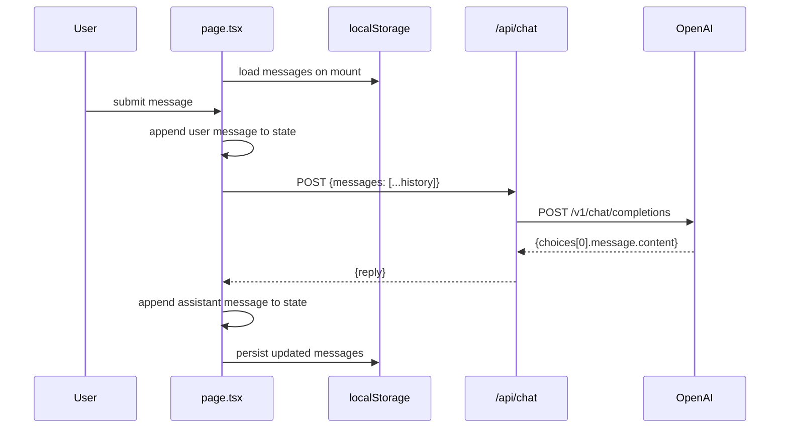

# spec.md

## Application Architecture

```mermaid
flowchart TD
    User([User]) -->|types message| UI[app/page.tsx\nChat UI]

    UI -->|loads on mount| LS[(localStorage\nchat_messages)]
    UI -->|saves on change| LS

    UI -->|POST /api/chat\n{messages}| API[app/api/chat/route.ts\nAPI Route]

    API -->|reads| ENV[OPENAI_API_KEY\n.env.local]
    API -->|POST chat/completions\ngpt-4o-mini| OpenAI[OpenAI API]
    OpenAI -->|{reply}| API
    API -->|{reply}| UI

    UI -->|renders| MI[components/MessageItem.tsx]
    MI -->|assistant messages| MD[react-markdown\n+ remark-gfm]
    MI -->|user messages| PT[plain text]
```

## Data Flow


